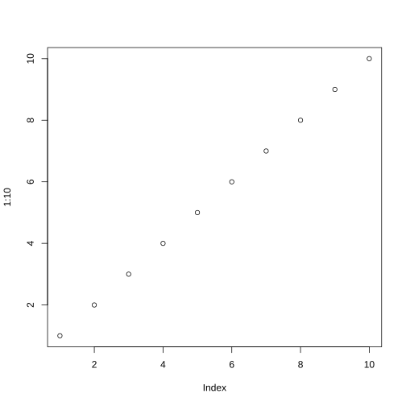

# Overview

The package is used for microbial profiling data analysis, including community
similarity / dissimilarity / distance calculation and network comparison.

# Input data
*MINA* package expects count data (e.g. OTU table or ASV table) to represent
community profiling results and a descriptive table which indicates the
information of each sample. In the quantitative table, each row contains one
composition in the community and each column represents one profiled sample. In
the descriptive table, same samples as rows in quantitative table should be
included in the column "**Sample_\_ID**".

## Import data
Using `new()` to create a new object and then import data into the object. The
package was written followed S4 rules thus @ will be used for indicating slots.
The slots could be imported separately after creating a new object:

```r
    maize <- new(mina)
    maize@tab <- maize_asv
    maize@des <- maize_des
```
Or together at the same time when starting a new object:

```r
    maize2 <- new(mina, tab = maize_asv, des = maize_des)
```

## Check data format and tidy up
For the format of data, one could take a look at the data included in the
package as indicated as before. Also functions are developed to double check the
format of imported data, both quantitative and descriptive table.

```r
    # return TRUE if both quantitative and descriptive files are imported with
    # right format
    check_mina(maize)
    # return error message if @tab of the object doesn't exist
    check_mina_qu(maize)
    # return TRUE if @tab or @des both exist and contain the same samples
    check_mina_de(maize)
```
After checking, if there is mismatch between quantitative and descriptive
tables, `fit_tabs()` could be used to trim two tables.

```r
    maize <- fit_tabs(maize)
```

# Diversity analysis of the community
Typically the analysis of microbial community data includes estimating within
and between sample diversities (alpha- and beta-diversity) based on
compositions. By counting the number of observed compositions and evaluating
the evenness of their distribution, alpha diversity of each community is
quantified. Distance or dissimilarity between samples calculated from counts
differentiation of compositions is used to indicate the beta diversity of
community.

## Data normalization
Due to the varied sequencing depth, it is essential to normalize the data before
the analysis of the diversity.
Rarefaction and normalization by total sum are available here. For rarefaction,
to reduce the random effect, multiple times bootstrap is recommended. The
normalized table will be stored in the same *mina* object automatically when
it were given as input.

```r
    # check available normalization methods
    ? norm_tab_method_list
    # normalized by total sum
    maize <- norm_tab(maize, method = "total")
    # normalized by rarefaction
    maize <- norm_tab(maize, method = "raref")
    maize <- norm_tab(maize, method = "raref", depth = 1000)
    # normalized by rarefaction and bootstrap 99 times
    maize <- norm_tab(maize, method = "raref", multi = 99)
```
When given a matrix for normalization, the normalized matrix will be returned.

```r
    # normalized by total sum
    maize_asv_norm <- norm_tab(maize_asv, method = "total")
    # normalized by rarefaction
    maize_asv_norm <- norm_tab(maize_asv, method = "raref")
    maize_asv_norm <- norm_tab(maize_asv, method = "raref", depth = 1000)
    # normalized by rarefaction and bootstrap 99 times
    maize_asv_norm <- norm_tab(maize_asv, method = "raref", multi = 99)

```

## Community diversity
Based on the normalized quantitative table, distance / dissimilarity could be
calculated between pairwise samples and used for beta-diversity analysis.

```r
    # check available dissimilarity parameters
    ? com_dis_list
    # community dissimilarity calculation, Bray-Curtis used in example
    maize <- com_dis(maize, method = "bray")
    # TINA dissimilarity in Schmidt_et_al_2016
    maize <- com_dis(maize, method = "tina")
```
For *TINA* dissimilarity in `com_dis()` function, *Spearman* correlation and
weighted Jaccard was used by default, to calculate *TINA* with other options,
use function `tina()`.

```r
    # get the TINA dissimilarity of normalized quantitative table
    maize_tina <- tina(maize_asv_norm, cor_method = "spearman", sim_method =
                       "w_ja", threads = 80, nblocks = 400)
```

## Unexplained variance of community diversity
To evaluate the biological meaningful variance and noise ratio, the ratio of
variance that could not be explained by any factors was calculated.

```r
    # get the unexplained variance ratio of quantitative table according to the
    # group information indicated in descriptive table.
    com_r2(maize, group = c("Compartment", "Soil", "Host_genotype"))
    # use tables as input
    maize_dis <- maize@dis
    get_r2(maize_dis, maize_des, group = c("Compartment", "Soil", "Host_genotype"))
```

## Community beta-diversity visualization
PCoA (Principle Coordinate Analysis) is usually used for the visualization of
beta-diversity of microbial community data. By using different color and shape,
samples from different conditions are compared.

```r
    # plot the community beta-diversity
    # separate samples from different conditions by color, plot PCo1 and PCo2
    p1 <- com_plot(maize, match = "Sample_ID", color = "Compartment")
    # plot PCo3 and PCo4
    p2 <- com_plot(maize, match = "Sample_ID", d1 = 3, d2 = 4, color =
                    "compartment")
    # in addition, separate samples from different soil type by shape
    p3 <- com_plot(maize, match = "Sample_ID", color = "Compartment", shape =
                    "Soil")
    # plot PCo1 and PCo4
    p4 <- com_plot(maize, match = "Sample_ID", d1 = 1, d2 = 4, color =
                    "Compartment", shape = "Soil")
```
When using dissimilarity matrix as input, the `dmr()` function is used to reduce
the dimension of data and `pcoa_plot()` is used for plotting.

```r
    maize_dmr <- dmr(maize_dis, k = 4)
    p <- pcoa_plot(maize_dmr, maize_des, match = "Sample_ID", d1 = 3, d2 = 4,
                   color = "Host_genotype")
```

# Network inference and clustering
For the microbial community research, diversity analysis capture only static
features and co-occurrence networks are typically inferred to indicate dynamics
of the system.

## Correlation coefficient adjacency matrix
Correlation will be calculated according to the covariance of compositions
across samples.

```r
    # check available adjacency matrix
    ? adj_method_list
    # Pearson and Spearman correlation
    maize <- adj(maize, method = "pearson")
    maize <- adj(maize, method = "spearman")
    # Sparcc correlation
    maize <- adj(maize, method = "sparcc", threads = 20, nblocks = 400)
```
Also the function could be applied to matrix directly, the correlation between
pairwise rows will be calculated.

```r
    # Pearson and Spearman correlation
    asv_adj <- adj(maize_asv_norm, method = "pearson")
    asv_adj <- adj(maize_asv_norm, method = "spearman")
    asv_adj <- adj(maize_asv_norm, method = "sparcc")
```

## Network clustering
By removing the non-significant(waiting for update) and weak correlations, the
network of each adjacency matrix is generated and closely related nodes will be
inferred by clustering methods. In the package, Markov Cluster Algorithm (MCL,
Dongen, 2000) and Affinity Propagation (AP, Frey _et al_, 2007) are integrated
for network clustering.

```r
    # check available network clustering methods
    ? net_cls_list
    # network clustering by MCL
    maize <- net_cls(maize, method = "mcl")
    maize <- net_cls(maize, method = "mcl", cutoff = 0.4)
    # network clustering by AP
    maize <- net_cls(maize, method = "ap")
    maize <- net_cls(maize, method = "ap", cutoff = 0.4, neg = FALSE)
```
Also it is possible to give a adjacency matrix directly and got the generated
cluster data frame.

```r
    # filter the weak correlation by cutoff and cluster by MCL
    asv_cls <- net_cls(asv_adj, method = "mcl", cutoff = 0.4)
    # filter and cluster by AP
    asv_cls <- net_cls(asv_adj, method = "ap")
```

# Higher-order feature based diversity analysis
By accumulating the relative abundance of compositions belong to the same
network clusters, the higher-order feature quantitative table is obtained and
could be used for further diversity analysis. Besides, compositions belong to
the same phylogenetic group could also be grouped together as new quantitative
table.

## Higher-order quantitative table
According to the network cluster assignments, compositions belong to the same
higher order level group are accumulated by summing up their relative
abundances.

```r
    # get the cluster table by summing up compositions of the same cluster
    maize <- net_cls_tab(maize)
```

## Community diversity analysis and comparison
Same diversity analysis could be applied to cluster table and compared with
composition based table.

```r
    # dissimilarity between samples based on cluster table
    maize_cls_tab <- maize@cls_tab
    maize_cls_dis <- com_dis(maize_cls_tab, method = "bray")
    get_r2(maize_cls_dis, maize_des, group = c("Compartment", "Soil",
                                               "Host_genotype"))
```

# Network comparison and statistical test

## Bootstrap-permutation based network construction

## Network distance calculation and significance test


# About this vignette
- **bold** - Bold is used for emphasis.
- *italics* - Italics are used for package names, and special words, phrases.
- `code font` - The font for code, usually courrier-like, but depends on the
  theme.
- `myFun()` - Code font word with `()` attached at the right-end, is a function
  name.
- [Hyperlink](#sec:typeset-legend) - Hyperlinks are
clickable text that will jump to sections and external pages.

## Styles

The `html_vignette` template includes a basic CSS theme. To override this theme you can specify your own CSS in the document metadata as follows:

    output: 
      rmarkdown::html_vignette:
        css: mystyles.css

## Figures

The figure sizes have been customised so that you can easily put two images side-by-side. 


```r
plot(1:10)
```



You can enable figure captions by `fig_caption: yes` in YAML:

    output:
      rmarkdown::html_vignette:
        fig_caption: yes

Then you can use the chunk option `fig.cap = "Your figure caption."` in **knitr**.

## More Examples

You can write math expressions, e.g. $Y = X\beta + \epsilon$, footnotes^[A footnote here.], and tables, e.g. using `knitr::kable()`.


|                  |  mpg| cyl|  disp|  hp| drat|    wt|  qsec| vs| am| gear| carb|
|:-----------------|----:|---:|-----:|---:|----:|-----:|-----:|--:|--:|----:|----:|
|Mazda RX4         | 21.0|   6| 160.0| 110| 3.90| 2.620| 16.46|  0|  1|    4|    4|
|Mazda RX4 Wag     | 21.0|   6| 160.0| 110| 3.90| 2.875| 17.02|  0|  1|    4|    4|
|Datsun 710        | 22.8|   4| 108.0|  93| 3.85| 2.320| 18.61|  1|  1|    4|    1|
|Hornet 4 Drive    | 21.4|   6| 258.0| 110| 3.08| 3.215| 19.44|  1|  0|    3|    1|
|Hornet Sportabout | 18.7|   8| 360.0| 175| 3.15| 3.440| 17.02|  0|  0|    3|    2|
|Valiant           | 18.1|   6| 225.0| 105| 2.76| 3.460| 20.22|  1|  0|    3|    1|
|Duster 360        | 14.3|   8| 360.0| 245| 3.21| 3.570| 15.84|  0|  0|    3|    4|
|Merc 240D         | 24.4|   4| 146.7|  62| 3.69| 3.190| 20.00|  1|  0|    4|    2|
|Merc 230          | 22.8|   4| 140.8|  95| 3.92| 3.150| 22.90|  1|  0|    4|    2|
|Merc 280          | 19.2|   6| 167.6| 123| 3.92| 3.440| 18.30|  1|  0|    4|    4|

Also a quote using `>`:

> "He who gives up [code] safety for [code] speed deserves neither."
([via](https://twitter.com/hadleywickham/status/504368538874703872))
